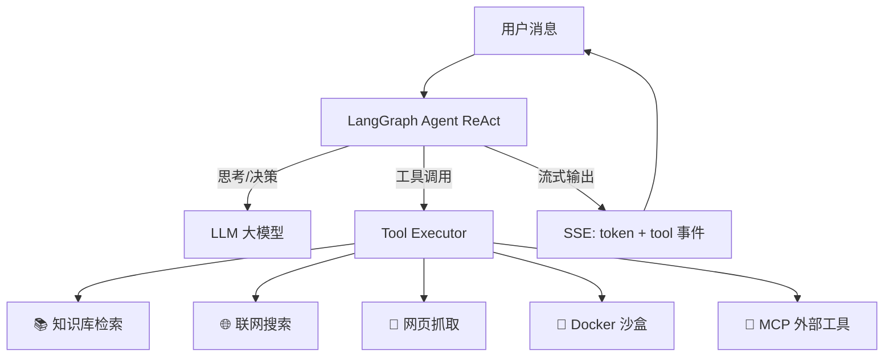
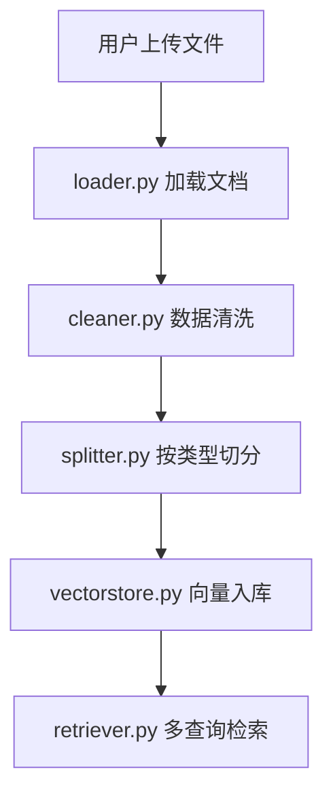
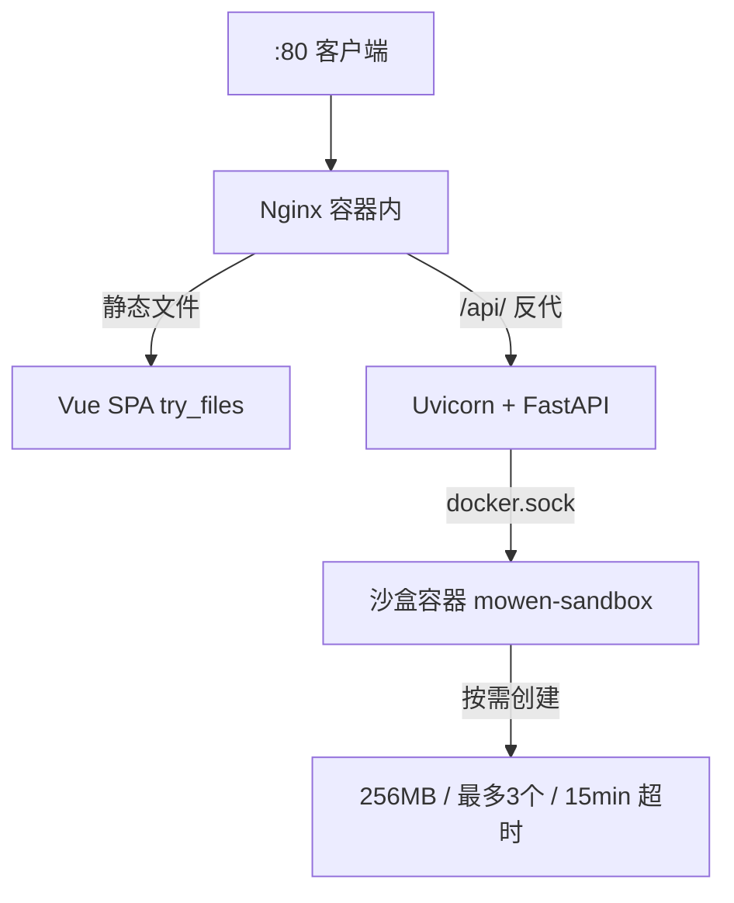

# 墨问 MoWen

> 基于 LangGraph 的智能 AI Agent，集成知识库 RAG、联网搜索、Docker 代码沙盒、MCP 工具与长期记忆。

## ✨ 核心特性

| 特性 | 说明 |
|------|------|
| 🤖 **Agent 自主决策** | LLM 自动判断是否调用工具，无需手动切换模式 |
| 🐳 **Docker 沙盒** | 隔离容器中执行代码 / 安装包 / 处理文件，workspace 持久化 |
| 📚 **知识库 RAG** | 自动清洗 + 切分入库，支持 PDF / Word / TXT / MD，按类型定制策略 |
| 🌐 **联网搜索** | Tavily 实时搜索 + 网页抓取转 Markdown |
| 🔧 **MCP 工具** | 文件系统 / Playwright 浏览器 / GitHub 等外部工具集成 |
| 🧠 **长期记忆** | 自动提取用户事实 / 偏好 / 对话摘要，JSON 持久化 |
| 📝 **Skills 技能** | Markdown 格式可扩展场景指导，按需自动加载 |
| ⏰ **定时任务** | APScheduler 支持 cron / 间隔 / 单次触发 |
| 🎭 **人格设定** | 可自定义 Agent 性格与回答风格 |
| 📊 **Token 统计** | 实时显示用量进度条，内置 50+ 模型上下文数据 |
| 🏢 **多厂商** | DeepSeek / 智谱 AI / Kimi / 硅基流动（OpenAI 兼容接口） |
| 🐳 **一键部署** | Docker Compose 多阶段构建（前端 + 后端 + Nginx） |

## 🏗️ 架构



## 🛠️ 技术栈

| 层 | 技术 |
|---|---|
| 前端 | Vue 3 + TypeScript + Vite + Element Plus |
| Agent | LangGraph ReAct + create_react_agent |
| LLM | DeepSeek / 智谱 AI / Kimi / 硅基流动（OpenAI 兼容） |
| Embedding | OpenAI 兼容（BGE / Qwen3 / 智谱，兼容非 OpenAI 模型） |
| 向量库 | ChromaDB（维度自动检测与校验） |
| 沙盒 | Docker SDK（mowen-sandbox 自建镜像，workspace 持久化） |
| MCP | langchain-mcp-adapters + @playwright/mcp |
| 后端 | FastAPI + SSE 流式 |
| 数据库 | SQLite（WAL + 线程本地连接） |
| 部署 | Docker Compose（Nginx + Uvicorn 单容器） |

## 🚀 快速开始

### 本地开发

```sh
# 后端
uv sync
uv run uvicorn api:app --reload --host 0.0.0.0 --port 8000

# 前端（另一个终端）
cd frontend && npm install && npm run dev
# 访问 http://localhost:5173
```

### 测试

```sh
python -m pytest tests/ -v                                    # 全部测试
python -m pytest tests/ --cov=server --cov=app --cov-report=term-missing  # 带覆盖率
```

### Docker 部署

```sh
docker build -t mowen-app:latest -f Dockerfile.app .
docker build -t mowen-sandbox:latest -f Dockerfile.sandbox .
docker compose up -d
# 访问 http://localhost
```

## 📁 项目结构

```
.
├── api.py                      # 启动入口
├── server/                      # 核心引擎包
│   ├── core/                        # 基础设施（config/db/logging/scheduler）
│   ├── llm/                         # LLM 抽象层（factory/embeddings/provider）
│   ├── rag/                         # RAG 管线（loader/cleaner/splitter/vectorstore）
│   ├── retrieval/                   # 检索（多查询 + 查询扩写）
│   ├── prompts/                     # 提示词统一管理
│   └── agent/                       # Agent 子包（graph/tools/sandbox/mcp/memory/skills）
├── app/                         # FastAPI 路由层（chat/files/knowledge_bases/settings...）
├── skills/                      # 技能文件（Markdown，自动扫描）
├── frontend/                    # Vue 3 前端
├── data/                        # 用户配置 + 记忆 + 上传文件
├── vectorstore/                 # Chroma 持久化数据
├── tests/                       # pytest 测试
├── Dockerfile.app               # 应用镜像（多阶段构建）
├── Dockerfile.sandbox           # 沙盒镜像
└── docker-compose.yml           # 编排配置
```

## ⚙️ 配置

`data/user_settings.json` 是唯一配置文件，首次运行自动生成。核心配置项：

| 配置 | 说明 |
|------|------|
| `active_model` / `embedding_model` | 当前模型，格式 `provider/model` |
| `providers` | 厂商配置：API Key、base_url、模型列表 |
| `generation` | 生成参数：temperature、max_tokens、thinking |
| `model_context_overrides` | 模型级覆盖：上下文窗口、最大输出、temperature |
| `chunking` | 文档切分：块大小、重叠、章节切分 |
| `retrieval` | 检索参数：top_k、查询扩写 |
| `agent.tavily_api_key` | 联网搜索 API Key |
| `mcp_servers` | 外部 MCP 服务器配置（逐服务器容错） |
| `skills` | 启用的技能列表，对应 `skills/*.md` |
| `embedding_custom` | 自定义向量模型（最高优先级） |
| `persona` / `user_profile` | 人格设定 / 用户画像 |
| `memory` | 长期记忆配置 |

### 模型上下文窗口

`server/llm/model_context.py` 内置 50+ 模型官方上下文数据。优先级：用户覆盖 > 内置数据 > 默认 128K。前端实时显示 token 用量进度条。

### 长期记忆

每轮对话后自动提取 fact / preference / summary，存入 `data/memories.json`，下次对话自动注入系统提示词。

## 🤖 Agent 模式

Agent 自主决定何时调用工具，无需手动切换模式：

```
用户: "这个小说里最后谁赢了？"
Agent: → search_knowledge_base("最终结局") → 找到终章内容 → 回答

用户: "今天天气怎么样？"
Agent: → search_web("北京天气") → 返回实时天气

用户: "帮我画个柱状图"
Agent: → sandbox_write_file("plot.py") → sandbox_run("python plot.py")
      → sandbox_export_file("chart.png") → 图片直接在聊天中渲染

用户: "你好，介绍一下自己"
Agent: → 不调用工具，直接回答
```

### Agent 工具

| 类别 | 工具 | 说明 |
|------|------|------|
| 🐳 沙盒 | `sandbox_run` | 执行 shell 命令 |
| | `sandbox_write/read/edit_file` | 文件创建/读取/编辑 |
| | `sandbox_list_files` | 列出目录 |
| | `sandbox_export_file` | 导出文件为下载链接 |
| 🔧 MCP | `export_mcp_file` | 导入 MCP 浏览器文件到沙盒 |
| | `list_mcp_files` | 列出 MCP 浏览器输出文件 |
| 📚 知识库 | `search_knowledge_base` | 搜索用户上传的知识库 |
| 🌐 搜索 | `search_web` | 联网搜索（Tavily） |
| | `fetch_webpage` | 抓取网页内容转 Markdown |
| 📝 技能 | `load_skill` | 加载技能指导内容 |
| | `search_skills` / `install_skill` | 搜索/安装开源技能 |

### 提示词工程

所有提示词统一在 `server/prompts/` 集中管理，支持段落级组合与动态注入。

**Agent 系统提示词**采用段落组合模式：身份 + 能力 + 沙盒说明 + 工具原则 + 文件处理 + 多步骤 + 防循环 + 输出规范（静态）+ 人设 + 技能 + 时间 + 记忆 + 画像 + 文件（动态注入）。

其他提示词：
- **RAG 问答**：忠实上下文、标注来源、结构化输出
- **查询扩写**：多角度生成语义相关查询（关键词替换/视角转换/实体补全/句式变化）
- **记忆提取**：提取 fact / preference / summary，跳过闲聊，宁缺毋滥

### Skills 技能系统

`skills/` 目录下 `.md` 文件自动扫描加载，Agent 按需调用 `load_skill` 获取指导。当前内置：数据分析、文档转换、网页爬取、Mermaid 图表、Word 文档。新增技能只需创建 `.md` 文件。

### 添加新厂商

`server/llm/factory.py` 使用注册表模式，加新厂商只需一个装饰器：

```python
@register_provider("openai")
def _build_openai(config):
    return ChatOpenAI(api_key=..., **_build_kwargs(config))
```

## 🔒 工程质量

| 模块 | 要点 |
|------|------|
| **日志系统** | Logger 工厂 + 双输出（控制台彩色 + 文件轮转 10MB×5）+ RequestIdFilter 请求追踪 + 按模块独立级别 |
| **错误处理** | 统一异常体系（7 种业务异常 → HTTP 状态码）+ 三层隔离（用户消息 / 内部详情 / 完整堆栈） |
| **文件安全** | 200MB 上传限制 + 类型白名单（40+ 扩展名）+ 路径穿越防护 + 24h 自动清理 |
| **MCP 容错** | 逐服务器独立连接 + 30s 超时 + 全部失败仍可用内置工具 |
| **定时任务** | APScheduler + SQLite 持久化 + cron/间隔/单次触发 + 重启自动恢复 |
| **配置加载** | `RAGConfig.from_settings()` 自动创建默认配置 + 前端 API 管理 |

### 向量模型配置

优先级从高到低：自定义配置（`embedding_custom`）→ 厂商模型选择（`embedding_model`）→ 自动推断。

## 📖 RAG 管线



| 阶段 | 说明 |
|------|------|
| **加载** | PDF/Word/TXT/MD/CSV/JSON，PDF 合并整书避免跨页割裂 |
| **清洗** | 统一换行 / 去零宽字符 / NFKC 标准化 / 修复 PDF 断词 / 去页码 / 过滤目录页 |
| **切分** | 按知识库类型定制（见下表） |
| **入库** | Chroma 分批嵌入 + 维度检测记录 |
| **检索** | 查询扩写 + 多查询检索 + 去重，小说类型特殊重排 |

| 类型 | 切分策略 |
|------|----------|
| `novel` 小说 | 章节检测 + 长章节细切 + 噪声过滤 |
| `tech` 技术文档 | Markdown 标题层级切分，失败降级递归 |
| `project` 项目文档 | 保护代码块/表格的递归切分 |
| `book` 专业书籍 | 章节检测 + 代码块/表格保护 + 递归细切 |
| `general` 通用 | 递归切分（或章节切分） |

## 🐳 Docker 部署

### 架构



### 部署方式

```sh
# 方式一：一键部署（本地构建 → 传服务器 → 启动）
chmod +x deploy/build-and-deploy.sh
./deploy/build-and-deploy.sh 服务器IP

# 方式二：手动部署
docker build -t mowen-app:latest -f Dockerfile.app .
docker build -t mowen-sandbox:latest -f Dockerfile.sandbox .
docker compose up -d
curl http://localhost/api/health
```

### 日常运维

```sh
docker compose logs -f          # 查看日志
docker compose restart           # 重启
docker exec -it mowen-app bash   # 进入容器调试
```
